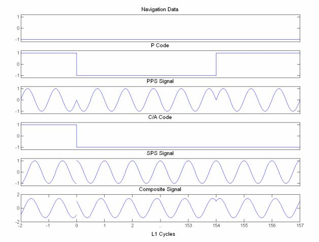

###2.1.1 GPS信号结构

每路GPS信号包含三部分：
* 载波：在fl1和fl2频率的正弦射频信号
* 测距码：又称为伪随机码序列或者伪随机码，它允许所有的卫星在同样的频带上发射信号而互不影响。SPS使用了一组Gold码（C/A码）来作为它的伪码，速率为1.023MHz。PPS使用了一组称为P(Y)码的极长伪码序列，速率为10.23MHz，是C/A码速率的10倍。C/A码长为1023，即每1ms循环一次。而P(Y)码每周循环一次，即在604800s时间内码长为6.1871*10^12。
* 导航电文：一组二进制编码信息，包含卫星的健康状态、星历数据、卫星时钟校正参数和历书。每颗卫星利用BPSK调制50Hz的导航电文，其总长度为37500比特，并不断的循环和随时间更新。从一颗卫星完整的接收所有的电文需要12.5分钟。

这三部分通过星载的10.23MHz的时钟保持同步。10.23MHz的时钟与码速率、L1、L2和导航电文速率的关系如下：

$$fl1=1575.42 MHz=154*10.23MHz$$

$$fl2=1227.60 MHz=120*10.23MHz$$

$$fdata=50 Hz=1/204600*10.23MHz$$

每个码片都与导航电文进行模2加和：如果码片与导航电文相同（同为0或者1）则结果为0；否则，结果为1。混合后的信号再与载波进行BPSK调制。

第i颗卫星发射的L1信号可以表示为：

$$S_{L1i}=\sqrt{2P_t}D_i(t)C_i(t)cos(\omega_{L1}t)+\sqrt{2P_p}D_i(t)P_i(t)sin(\omega_{L1}t)$$（2.2）

其中
	$$S_{L1i}$$是从$$SV_i$$发射的GPS L1信号；	
	$$P_t$$是C/A码信号的功率；	
	$$P_p$$是P(Y)码信号的功率；
	$$D_i(t)$$是导航电文比特；
	$$C_i(t)$$是伪随机噪声序列（C/A码）；
	$$\omega_{L1}$$是L1载波频率；
	$$t$$是GPS时间；
	$$P_i(t)$$是P码或者加密的P码（Y码）序列。
为了表示BPSK信号，导航电文的二进制数值需要转换为$$\pm 1$$，即0对应1，1对应-1。图2.1表示了C/A码信号各部分的关系。该示意图是一个理想化的模型，目的是为了阐述它们之间的关系。实际上，相位的改变从来不会像图片中描述的那样瞬间改变。

	
	
	
	
	
	
	
	
	
	
	
	
	
	
	
	
	
	
	
	
	
	