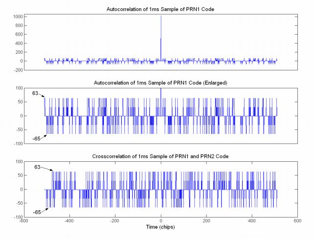

###2.1.4 CA码的自相关和互相关特性

自相关函数$$f(t)$$定义如下：
$$R(\tau )=\int\limits_{-\infty }^{+\infty }{f(t)f(t+\tau )dt}$$

白噪声的自相关函数除了在$$\tau=0$$外，其他各点都为0。也就是说，一组白噪声的采样向量与任何平移都不相关。伪随机码有着与白噪声相似的自相关特性。但是它的自相关图是分段的，而且在平移超过一个码片时自相关值也不总是0，这是因为伪随机码是有限长度的序列。它的自相关的峰值出现在$$\tau=0$$和$$\tau=\pmnT_c$$，其中$$T_c$$是码片的宽度，单位为s，$$n$$是一个整数。当平移超过程一个码片时，它的第二峰值分别为+63或者-65。

两个相互独立的、离散的有限长度白噪声向量是互不相关的，即它们的互相关值为0。Gold码之间的互相关特性与白噪声类似，虽然不完全是0，但是比起各自码的自相关峰值仍然是极小的。任何两个Gold码有着相同的互相关值，并随着码长的增加而变的更低。在C/A码的情况里，互相关值的最大至少为-23.9 dB，低于自相关值（在多普勒频移为0的情况下）。

PRN1的自相关和两组GPS Gold码（PRN1和PRN2）的互相关值如图2.3所示。自相关和互相关的图对于所有其他的PRN都有着相似的值。

